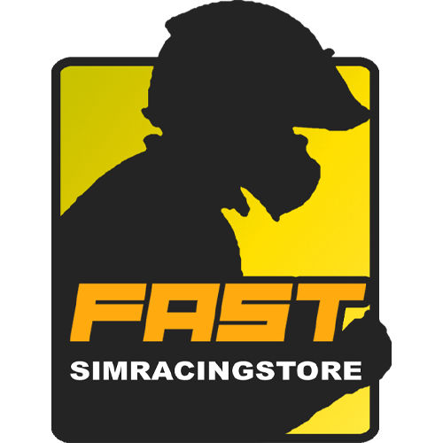
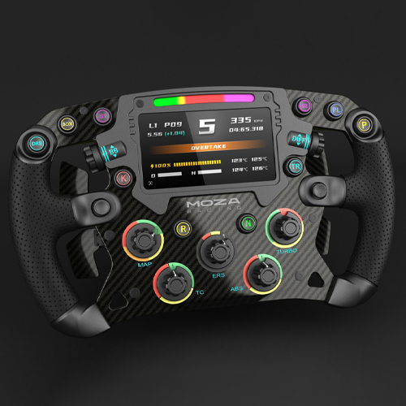
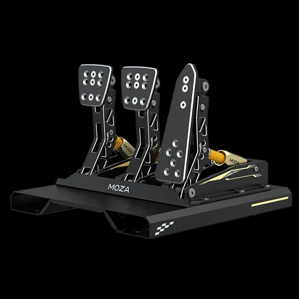
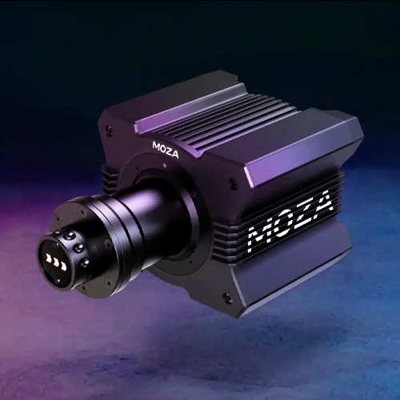
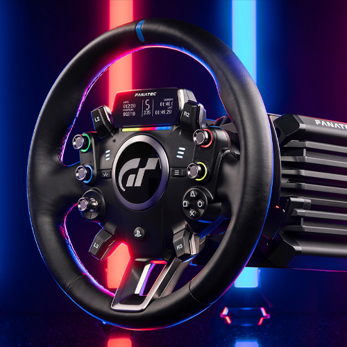
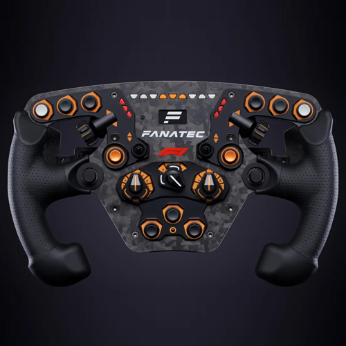
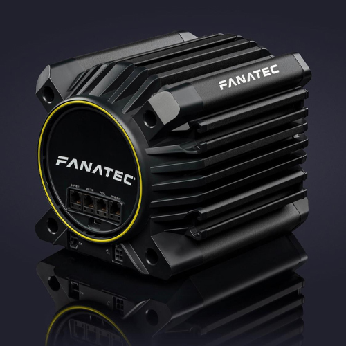

aca expolico como dividi el codigo. 
en 4 partes para resumir.

"header"
dos "Div" y un "aside"

los div tienen una imagen de fondo con texto relacionado a la tematica de la tienda
mas una galeria de imagenes responsiva cn animacion.

el aside tiene una foto en vertical. sobre un producto en concreto

y el footer contiene enlaces directos a redes sociales y contacto.

<!DOCTYPE html>
<html lang="en">
<head>
    <meta charset="UTF-8">
    <meta name="viewport" content="width=device-width, initial-scale=1.0">
    <title>Document</title>
    <link rel="stylesheet" href="style.css">
</head>
<body>
    <header>
        
        <nav class="nav-buttons">
            <button>Contacto</button>
            <button>Tienda</button>
            <button>Nuevas Llegadas</button>
            <button>Carrito</button>
        </nav>
    </header>
    

        <main>
             
        </main>
        <aside class="right">
            

                

                    <h2>A LA VANGUARDIA</h2>
                    
En Fast, tu tienda virtual de confianza, nos enorgullece ofrecer los mejores productos de simracing del mercado. 
                    Desde volantes de alta precisión y pedales ajustables, hasta simuladores completos y accesorios indispensables, 
                    en Fast encontrarás todo lo necesario para llevar tu experiencia de simulación de carreras al siguiente nivel.
                    Nuestro compromiso es brindar productos de calidad superior que satisfagan las exigencias de los pilotos más apasionados.
                    Explora nuestro catálogo y descubre por qué somos la opción preferida de la comunidad de simracing.
                    ¡Con Fast, la victoria está a solo un clic de distancia!

                

            

        </aside>
        <aside class="left">
            

                

                    <h2>PILOTO VIRTUAL</h2>
                    
El Simracing no es solo un juego, sino una puerta de entrada a una experiencia inmersiva que combina emoción,
                    habilidades y comunidad global. Animarse a explorar este mundo virtual no solo brinda diversión sin límites,
                    sino que también puede transformarse en una pasión que trasciende la pantalla.

                

            
  
            <section class="carrusel">
                
                
                
                
                
                
            </section>
        </aside>
    

    "footer
    <footer>
        
        

            <ul class="social-icon">
                <li class="icon-elem">
                    <a href="" class="icon">
                        <ion-icon name="logo-discord"></ion-icon>
                    </a>
                </li>
                <li class="icon-elem">
                    <a href="" class="icon">
                        <ion-icon name="logo-instagram"></ion-icon>
                    </a>
                </li>
                <li class="icon-elem">
                    <a href="" class="icon">
                        <ion-icon name="logo-whatsapp"></ion-icon>
                    </a>
                </li>
                <li class="icon-elem">
                    <a href="" class="icon">
                        <ion-icon name="logo-facebook"></ion-icon>
                    </a>
                </li>
                <li class="icon-elem">
                    <a href="" class="icon">
                        <ion-icon name="mail-outline"></ion-icon>
                    </a>
                </li>
            </ul>
            <ul class="menu">
                <li class="menu-elem">
                    <a href="" class="menu-icon"> Inicio </a>
                </li>
                <li class="menu-elem">
                    <a href="" class="menu-icon"> Equipo </a>
                </li>
                <li class="menu-elem">
                    <a href="" class="menu-icon"> Contacto </a>
                </li>
                <li class="menu-elem">
                    <a href="" class="menu-icon"> Video </a>
                </li>
                <li class="menu-elem">
                    <a href="" class="menu-icon"> Sobre Nosotros </a>
                </li>
            </ul>
            
Amamos el simracing

        

    </footer>

    
    
</body>
</html>

el CSS se encarga de la ubicacion y colores de los estilos
tuve algunos problemas cn el que no pude solucionar como la subposicion de algunos  iconos de enlace.

aca dejo el css

tambien use mas bien integre una fuente llamada Rubik de google fonts. que era mas del estilo de la tienda 

y cree un logo para la misma. lo hice yo no lo baje de internet.

gracias !!

@import url('https://fonts.googleapis.com/css2?family=Rubik:ital,wght@0,300..900;1,300..900&display=swap');

* {
    margin: 0;
    padding: 0;
    box-sizing: border-box;
}

body {
    background-image: url(./imagenes/galeria/BGmain.jpg);
    font-family: 'Rubik', sans-serif;
    text-align: center;
    color: azure;
    font-size: 20px;
    display: flex;
    flex-direction: column;
    min-height: 100vh;
}

header {
    background-image: url(./imagenes/banner/Bannerimage.jpg);
    background-size: cover;
    background-repeat: no-repeat;
    background-position: center;
    width: 100%;
    height: 300px;
    display: flex;
    justify-content: space-between;
    align-items: center;
    padding: 0 20px;
}

header .logo {
    width: 150px;
    height: 150px;
}

.nav-buttons {
    display: flex;
    gap: 15px;
}

.nav-buttons button {
    background-color: rgba(255, 255, 255, 0.8);
    border: none;
    padding: 10px 20px;
    font-size: 16px;
    cursor: pointer;
    transition: background-color 0.3s ease;
}

.nav-buttons button:hover {
    background-color: rgba(255, 255, 255, 1);
}

.main {
    display: flex;
    justify-content: center;
    align-items: center;
    width: 100%;
    margin: 20px 0;
}

main {
    background-image: url(./imagenes/galeria/loadd.jpg);
    background-size: cover;
    background-repeat: no-repeat;
    background-position: center;
    width: 800px;
    height: 1000px;
    display: flex;
    flex-direction: column;
    align-items: center;
    justify-content: center;
    color: white;
    padding: 10px;
}

h2 {
    margin-top: 20px;
    margin-bottom: 20px;
}

p {
    margin: 10px;
    text-align: justify;
    padding: 5%;
}

.secondary {
    width: 100%;
    display: flex;
    flex-direction: column;
    align-items: center;
    margin-top: 20px;
}

.left {
    background-image: url(./imagenes/galeria/Content.jpg);
    padding: 10em 5em;
    display: flex;
    flex-direction: column;
    align-items: center;
    justify-content: center;
}

.text-box-right,
.text-box {
    color: white;
    display: flex;
    flex-direction: column;
    align-items: center;
}

.carrusel {
    display: flex;
    width: 800px;
    height: 500px;
    overflow: hidden;
    margin-top: 20px;
}

.carrusel img {
    width: 0;
    flex-grow: 1;
    object-fit: cover;
    opacity: 0.8;
    transition: 0.5s ease;
}

.carrusel img:hover {
    cursor: pointer;
    width: 300px;
    opacity: 1;
    filter: contrast(110%);
}

.footer {
    height: 200px;
    width: 100%;
    background-color: rgb(18, 18, 18);
    padding: 50px 60px;
    display: flex;
    justify-content: center;
    align-items: center;
    flex-direction: column;
}

.social-icon {
    display: flex;
    justify-content: center;
    align-items: center;
    margin: 5px 0;
    flex-wrap: wrap;
}

.icon-elem {
    list-style: none;
}

.icon {
    color: rgb(230, 165, 0);
    font-size: 32px;
    margin: 50x 150px;
    transition: 0.5s;
}

.icon:hover {
    transform: translateY(-20px);
}

.menu {
    display: flex;
    justify-content: center;
    align-items: center;
    margin: 0px 5px;
}
